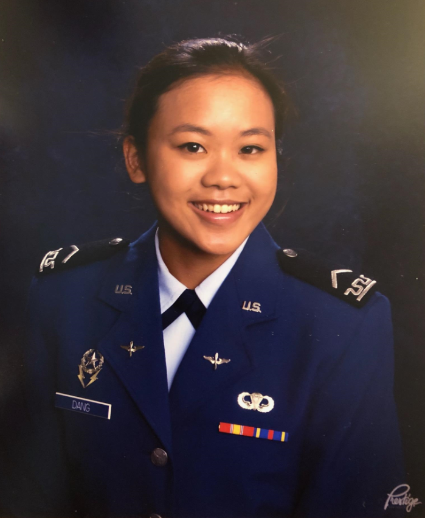

===================
Tricia Dang
===================

My name is Tricia, and I was born in Canada and raised in Suwanee, GA.
I grew up in an Asian household, where many of the stereotypes of Asians
became true: excelling in math, starting to play an instrument from a young
age, and of course, being terrible at driving. Growing up in this
environment has shaped me into the hard-working, perseverant student
I am today. I try to push myself in everything that I do, always striving
for perfection. Mediocre effort is a concept that is foreign to me and
something that I do not understand when I see it in other people.
Additionally, family is always first on my list before anything else and
is irreplaceable.

Personal
========

Email
  c20tricia.dang@usafa.edu

GitHub username
  @triciadang

Hometown
  Suwanee, GA

Unit
  CS-31

Major
  Computer Science and Cyber Science

Hobbies
  Violin and Swim and League of Legends

Prior Experience
================

Programming

* Python - About 1 year
* C - About 1 year
* Java - 1 semester

Databases

* None

Course
======

I am taking this course in hopes of expanding my knowledge of the cyber world.
Much of the cyber jobs in the Air Force involve using information and being
able to store it and later access it. I hope to gain competency in this
area in order to become a more knowledgeable officer in the Air Force.
Topics that I am interested would have to be HTML and CSS and JavaScript as
well as privacy protection. My sister is a web designer, and I would love to
be able to look over her shoulder after this course and know what she is
doing. I am interested in privacy protection because as a potential future
cyber officer, cyber defense is a vital topic that will be relevant to my
future career. Topics I'd prefer to avoid is ER Modeling because I still
remember not enjoying drawing the diagrams in Software Engineering.
